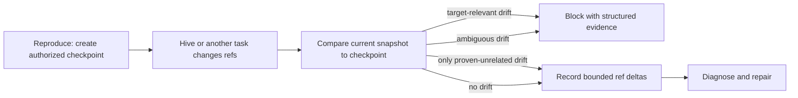

# Root Cause Repair Repository Authority

## Goal Capsule

Prevent Root Cause Repair from invalidating its own diagnosis when Hive or a concurrent task updates unrelated Git refs, while preserving fail-closed behavior for any change that can alter the target under repair.

## Product Contract

### Summary

Create an implementation-ready, manifest-free Root Cause Repair candidate that separates target authority from repository observation. The candidate must compare ref records individually, block on target-relevant or ambiguous drift, record unrelated drift, and continue when target HEAD, branch, index, and file bytes remain pinned to the current authorized stage checkpoint.

### Problem Frame

The released `packages/root-cause-repair/1.0.0` evidence tool hashes every ref below `refs/` into one authority fingerprint. A real Hive installation stores `.hive-state` as a linked worktree, so Hive's normal `hive/state` bookkeeping changes that aggregate between reproduction and diagnosis even though the target checkout is unchanged. The workflow therefore blocks before diagnosis and cannot repair the reported bug.

The fix must retain complete, content-blind observation of repository refs without granting proven-unrelated branches, remote-tracking refs, or concurrent workflow refs authority over the repair target. Tags, stashes, and unknown namespaces remain fail-closed because their relevance cannot be proven from ref records alone.

### Requirements

- **R1 - Pin target authority.** A phase-scoped checkpoint pins the resolved HEAD commit, symbolic branch, index entries, tracked worktree bytes, untracked worktree bytes, the symbolic HEAD ref, and per-worktree refs. `.git`, `.hive-state`, and Git-ignored paths stay excluded from worktree-byte authority, so Hive bookkeeping bytes cannot invalidate the target.
- **R2 - Compare refs individually.** Later captures compare the union of checkpoint and current ref names, including creations and deletions, by name, object ID, and object type. The pinned symbolic HEAD and `refs/bisect/*`, `refs/worktree/*`, and `refs/rewritten/*` are relevant. Any `refs/heads/*` other than the pinned branch and all `refs/remotes/*` are unrelated to the pinned checked-out target. Tags, stash, and every other namespace are ambiguous. Relevant or ambiguous changes block; unrelated changes are recorded and do not block.
- **R3 - Preserve snapshot integrity.** The aggregate fingerprint remains a byte-stable identity for the complete captured snapshot, not an authority verdict. Capture consistency rechecks target authority plus relevant and ambiguous refs; it may retry that transient movement once before failing closed. Unrelated ref movement during measurement is recorded and does not trigger retry or `state_changed`.
- **R4 - Avoid evidence leakage and prompt blow-up.** Evidence exposes digests, exact counts, classifications, and at most 50 changed-ref records per classification ordered by ref name. Classification and the verdict cover every delta before truncation; each category carries an untruncated count, digest, and truncation flag. Evidence never exposes file contents, secret values, or an unbounded full ref list.
- **R5 - Match real Hive topology.** Regression tests use a linked `.hive-state` worktree sharing the target repository's Git database and prove that normal Hive state commits and unrelated branch creation do not stop diagnosis.
- **R6 - Preserve repair safety.** Target HEAD/branch, index, tracked/untracked bytes, or ambiguous ref drift must stop diagnosis and end with semantic `blocked` evidence.
- **R7 - Keep release authority separate.** The immutable `packages/root-cause-repair/1.0.0` tree, catalog, manifests, versions, and deployment artifacts are unchanged. This work produces an unpublished candidate only.
- **R8 - Advance only after authorized stage work.** Reproduce establishes the first checkpoint. Diagnose, repair, revise-repair, and verification must compare before acting, then may atomically advance the checkpoint only after inventorying and accepting that stage's permitted worktree effects. HEAD, index, relevant-ref, and ambiguous-ref drift can never be authorized by checkpoint advancement.

### Acceptance Examples

- **AE1:** Given a linked `.hive-state`, when Hive commits `refs/heads/hive/state` between reproduce and diagnose, the comparison records that ref as unrelated and diagnosis starts.
- **AE2:** Given an unchanged target, when another task creates or advances an unrelated local branch, the comparison records the branch and diagnosis continues.
- **AE3:** Given a pinned symbolic branch, when that branch or HEAD commit moves, the comparison reports relevant drift and the workflow blocks before diagnosis.
- **AE4:** Given an unknown ref namespace that cannot be proven unrelated, when it changes, the comparison classifies it as ambiguous and blocks safely.
- **AE5:** Given relevant, ambiguous, or target-byte authority changes during capture, the tool retries the measurement at most once; stable second measurement succeeds and repeated movement returns structured `state_changed` failure. Repeated unrelated ref movement is recorded and still succeeds.
- **AE6:** Given a repair intentionally changes a tracked implementation path and adds an untracked regression test, repair inventories those effects, advances the checkpoint, and verification succeeds; a further out-of-band mutation before verification blocks.

### Scope Boundary

This plan creates and validates `candidates/root-cause-repair/`. It does not choose a package version, alter the immutable released package, add or generate a canonical manifest, list a catalog entry, publish, deploy, or release. A temporary test-fixture manifest may be synthesized outside the repository solely for native Hive execution. Hive's presentation and retry semantics for terminal `blocked` outcomes are implemented in a separate Hive change.

## Planning Contract

### Key Technical Decisions

1. **Target authority is explicit, not the full ref namespace.** `session-settled: user-directed`. Pin HEAD, its symbolic branch, index, and tracked/untracked bytes. Rejected alternative: treat every ref as authority. Reason: shared Git databases contain Hive and concurrent-task refs that cannot alter the checked-out target.
2. **Individual ref deltas determine the verdict.** `session-settled: user-directed`. Relevant drift blocks; proven-unrelated drift is recorded and continues; ambiguous drift blocks. Rejected alternative: block on aggregate ref digest mismatch. Reason: an aggregate cannot distinguish target movement from benign concurrency.
3. **Use an unpublished candidate.** `session-settled: user-directed`. Implement under `candidates/root-cause-repair/` with no manifest. Rejected alternative: edit `packages/root-cause-repair/1.0.0` or choose a successor SemVer. Reason: released package sources are immutable and publication/version authority was not requested.
4. **Use a compact comparison artifact.** Store the content-blind checkpoint outside target authority, bind its digest in stage evidence, and emit only bounded changed-ref details during comparison. Rejected alternative: print or pass every ref through stage artifacts. Reason: large repositories can have thousands of refs and prompt evidence must remain bounded.
5. **Retry only unstable authority measurement.** One retry is permitted when target authority or relevant/ambiguous refs change during a single capture; unrelated ref movement is recorded without retry. Rejected alternative: retry semantic drift between stages or fail capture on unrelated movement. Reason: retry can remove an authority-measurement race but must neither normalize a real target change nor recreate global ref authority.
6. **Use a task-local moving checkpoint.** The tool stores full content-blind ref records in an atomically replaced `repository-authority.json` sidecar inside the current task folder. Stage artifacts bind its schema and digest but include only bounded summaries. Missing, corrupt, root-mismatched, or digest-mismatched checkpoints block. Rejected alternative: pass all ref records through prompts or keep only the original reproduction baseline. Reason: prompt transport is unbounded, while one immutable baseline would reject the workflow's intended repair edits.
7. **Treat only provably detached refs as unrelated.** Non-current local branches and remote-tracking refs are unrelated to the pinned checked-out target; the symbolic HEAD branch and per-worktree refs are relevant. Tags, stash, and unknown namespaces are ambiguous and block when changed. Rejected alternative: classify every non-HEAD ref as unrelated. Reason: commands can resolve tags and special refs even when checked-out bytes do not move.

### High-Level Technical Design

The candidate repository-state tool owns deterministic capture, comparison, and checkpoint advancement. Stage instructions consume its structured verdict rather than equating fingerprint equality with authority equality. The task-local `repository-authority.json` moves with the task folder between stages, lives under excluded `.hive-state`, is content-blind, is atomically replaced, is cryptographically bound into stage evidence, and is validated before comparison.

Reproduce creates the first checkpoint after its starting capture and advances it only after validating any reproduction byproducts. Diagnose compares before probing and advances after confirming it did not edit implementation or tests. Repair and revise-repair compare before editing and advance only after inventorying their intended uncommitted repair. Verification compares against the repair checkpoint before running tests, then advances only for accepted test byproducts. Certificate performs the final comparison without advancing. Every advancement rejects HEAD, index, relevant-ref, or ambiguous-ref drift.

## Implementation Units

### U1 - Add candidate repository-state capture and comparison

**Goal:** Provide a deterministic tool contract that distinguishes snapshot identity from target-authority drift.

**Files:**

- Create `candidates/root-cause-repair/tools/repository-state.rb`
- Create `candidates/root-cause-repair/assets/evidence-contract.md`
- Create `test/root_cause_repair_candidate_repository_state_test.rb`

**Approach:**

- Start from the released tool's bounded, content-blind file/index capture without modifying the released copy.
- Add explicit create, compare, and advance operations with a schema that binds target roots, HEAD, symbolic branch, index, tracked/untracked digests, and individual ref records.
- Validate the canonical task-relative `repository-authority.json` path; write it atomically; bind its digest in output; and fail closed when the sidecar is absent, corrupt, root-mismatched, or digest-mismatched.
- Classify the symbolic HEAD and per-worktree refs as relevant; classify non-current local branches and remote-tracking refs as unrelated; classify tags, stash, and unsupported or unknown namespaces as ambiguous.
- Keep aggregate snapshot/ref digests for identity and emit bounded changed-ref summaries for comparison evidence.
- Retry a complete capture once only on structured `state_changed` measurement failure.
- Define output as `verdict: continue|blocked` with `reason: unchanged|unrelated_refs|target_changed|ambiguous_refs`; after the single internal retry, structured tool error `state_changed` also maps to workflow `blocked`.

**Test scenarios:**

- Repeatable checkpoint and compare output without target mutation or secret disclosure.
- Target branch/HEAD, index, tracked, and untracked changes block.
- Hive state, other local branch, and remote-tracking creations, updates, and deletions are recorded and continue; tag, stash, per-worktree, and unknown-namespace changes block as ambiguous or relevant.
- Phase advancement accepts an inventoried tracked/untracked worktree repair but never HEAD, index, relevant-ref, or ambiguous-ref drift.
- Unknown namespaces fail closed; changed-ref output and resource use remain bounded.
- A single transient capture race succeeds on retry; repeated movement fails.

### U2 - Route workflow stages through the authority verdict

**Goal:** Ensure every stage continues on unrelated ref drift and blocks on target-authority drift.

**Files:**

- Create `candidates/root-cause-repair/README.md`
- Create `candidates/root-cause-repair/workflow.yml`
- Create `candidates/root-cause-repair/instructions/reproduce.md`
- Create `candidates/root-cause-repair/instructions/diagnose.md`
- Create `candidates/root-cause-repair/instructions/repair.md`
- Create `candidates/root-cause-repair/instructions/revise-repair.md`
- Create `candidates/root-cause-repair/instructions/verify.md`
- Create `candidates/root-cause-repair/instructions/certificate.md`
- Create `test/root_cause_repair_candidate_test.rb`

**Approach:**

- Make reproduction create and bind the first checkpoint, then explicitly advance it after accepted reproduction effects.
- Replace all later whole-fingerprint equality gates with compare-before-action and advance-after-authorized-work checkpoint semantics.
- Require stage artifacts to record unrelated ref deltas and preserve semantic `blocked` outcomes for relevant/ambiguous drift.
- Retain the released workflow's evidence, test, repair, and certificate requirements otherwise.

**Test scenarios:**

- Candidate is manifest-free and excluded from package/catalog scanners.
- Every post-reproduction stage requires the authority comparison and handles all verdicts.
- An intended tracked repair and new untracked regression test advance the checkpoint and reach verification, while an out-of-band mutation between checkpoints blocks.
- Certificate preserves verified, not-reproduced, and blocked semantic outcomes.

### U3 - Prove real linked-worktree and concurrent-task behavior

**Goal:** Reproduce the production topology that escaped the released tests.

**Files:**

- Create `test/root_cause_repair_candidate_hive_execution_test.rb`

**Approach:**

- Install the candidate through an ephemeral test registry whose temporary fixture manifest is synthesized only at test runtime; no canonical manifest, catalog entry, or version artifact is written to the repository.
- Initialize `.hive-state` as a linked worktree sharing the target Git database, not a nested independent repository.
- Advance the workflow through reproduce and diagnose while committing Hive state and creating/updating an unrelated branch between stages.
- Add negative cases for target branch movement and ambiguous refs.

**Test scenarios:**

- Normal Hive state commits do not stop diagnose.
- Concurrent unrelated branch creation/update does not stop diagnose.
- Relevant and ambiguous changes remain blocked before diagnose.

### U4 - Document the corrected contract and publication boundary

**Goal:** Make the candidate's authority model and unpublished status discoverable.

**Files:**

- Modify `candidates/README.md`
- Modify relevant pages under `wiki/`
- Create `wiki/log.d/<timestamp>-root-cause-repair-authority.md`

**Approach:**

- Document why aggregate ref identity is not the authority verdict, which ref changes are unrelated, and which changes fail closed.
- Link the candidate from the wiki and state that promotion to a package remains a separate owner-authorized release action.
- Record any unresolved classification edge cases in `wiki/gaps.md`.

## Verification Contract

- Run focused candidate tool tests and package-structure tests after U1/U2.
- Run the candidate native Hive execution test after U3.
- Run the Honeycomb broad local test checkpoint once before handoff.
- Confirm `git diff -- packages/root-cause-repair/1.0.0 catalog manifests` is empty.
- After the companion Hive fix is available, run the original capture bug from a fresh baseline through the candidate and require diagnosis, repair, tests, verification, and a viable terminal result; a self- or unrelated-ref invalidation fails acceptance. This is a cross-repository acceptance gate for the overall fix, not a package publication gate.

## Definition of Done

- The candidate tool proves AE1-AE5 with focused tests.
- The real linked-worktree regression reaches diagnosis despite Hive and unrelated branch ref updates.
- Target-relevant and ambiguous drift still block with bounded structured evidence.
- Workflow instructions consistently use the comparison verdict and record unrelated drift.
- The original capture bug is rerun from a fresh baseline after the companion Hive fix and reaches diagnosis, repair, tests, verification, and a viable terminal result without self- or unrelated-ref invalidation.
- Wiki and log fragment describe the new contract and remaining gaps.
- Released package sources, manifests, catalog entries, versions, and deployment artifacts are unchanged.
- The Honeycomb pull request is open and CI reaches a decided state.
